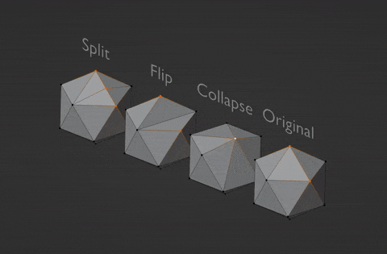

# Halfedge Lab
The implementation detail of the following content can be found in this repository.

## Geometry Construction
The halfedge data structure is constructed based on the geometry data, including vertices and faces, read from input `.obj` files.

## Atomic Mesh Operations
These atomic operations provide the basis for geometry processing functions:
- Edge flip
- Edge split
- Edge collapse

## Geometry Processing Functions
- Subdivide
- Simplify
- Remesh
- Noise/denoise
